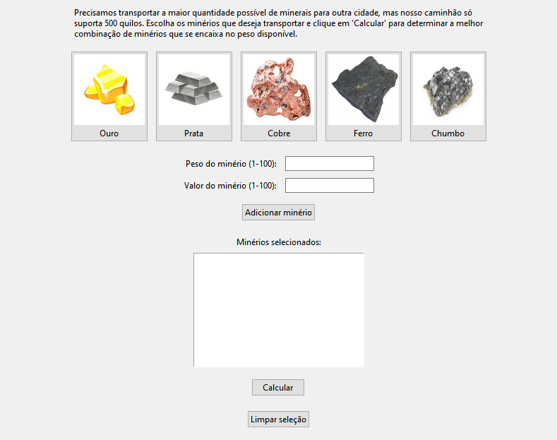

# Mineradora Joia Rara

**Conteúdo da Disciplina**: Algoritmos Ambiciosos <br>

## Aluna
|Matrícula | Aluna |
| -- | -- |
| 20/0041606  |  Marina Márcia Costa de Souza |
| 20/2046040  |  Dara Maria Barbosa de Sousa  |

## Sobre 
O projeto é uma interface gráfica e interativa por meio da qual o usuário pode escolher os minérios que deseja transportar, informar o peso e o valor de cada um que for selecionado. Utilizando o Algoritmo da Mochila (Knapsack), o projeto realiza a otimização da seleção dos itens, explorando diferentes combinações e escolhendo aquela que proporciona o maior valor possível dentro das restrições de capacidade da mochila.

## Screenshots




## Instalação 
**Linguagem**: Python 3.7.9 <br>

Uma vez que o python for instalado, execute o comando abaixo para instalar as dependências:

```cli
pip install tkinter 
````

Depois:

```cli
pip intall Pillow
```

## Uso 
Para rodar o código, use o seguinte comando:

```cli
python main.py
```
